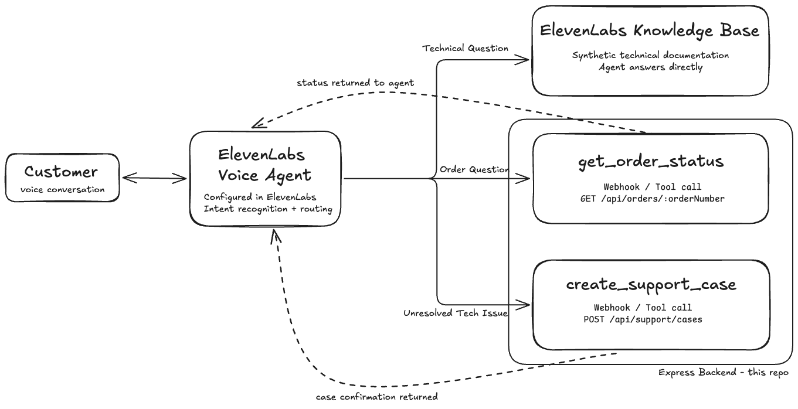

# B2B Scientific Support Agent

A voice agent for 3 common scientific-support questions: how to use a product, where an order is, and what to do when troubleshooting hasn't resolved an issue.

I built this to understand how a voice agent handles questions compared with a chatbot, especially when it needs to call an API. If an order lookup returns JSON with several items and shipment statuses, how does the agent turn that into an answer someone can follow over the phone? And when troubleshooting doesn't help, how does it collect the details needed to raise a support case?

The project uses ElevenLabs ElevenAgents and a small Express API. All the data used for order status and support case creation is synthetic and was created with the help of AI tools.

## The support workflow

A customer calling about a scientific instrument might need a troubleshooting answer, an update on a replacement part, or help from a technical specialist. Those requests need different information, even when they come up in the same conversation.

The agent has three paths:



Product documentation changes less often than order information, so it sits in the ElevenLabs Knowledge Base. Order questions go through a GET request. Escalation uses a POST request to submit the support details and get a case number back.

ElevenLabs handles the conversation and decides when to use each tool. This repository contains the TypeScript/Node.js API, 4 fixed example orders and some backend tests. The agent, its Knowledge Base and its evaluation setup are configured in the ElevenLabs platform.

## Running locally

With Node.js and npm installed:

```sh
npm install
npm run dev
```

The API runs on port `3000`. Try an order lookup:

```sh
curl http://localhost:3000/api/orders/SO-10482
```

To connect it to ElevenLabs, expose the local API through a public HTTPS tunnel such as ngrok (`ngrok http 3000`). Configure the `get_order_status` and `create_support_case` tools on the agent using that public URL and the endpoints below.

## API tools

| ElevenLabs tool | Endpoint | What it does |
| --- | --- | --- |
| `get_order_status` | `GET /api/orders/:orderNumber` | Returns order and shipment details, or `404` if the order isn't found. |
| `create_support_case` | `POST /api/support/cases` | Validates support details and returns a generated case number (`201`), or `400` for invalid input. |

Example orders: `SO-10481` (processing), `SO-10482` (partially shipped), `SO-10483` (shipped complete) and `SO-10484` (mixed shipments).

Support requests require `customerName`, `contactEmail`, `productName`, `serialNumber` and `issueDescription` as nonblank strings. `errorCode` (string) and `troubleshootingAttempted` (array of strings) are optional.

## Testing

```sh
npm test
npx tsc --noEmit
```

- **Backend:** Nine Vitest/Supertest tests covering shipment statuses, unknown orders, support-request validation and sequential case numbers.
- **Agent:** Tested separately in ElevenLabs using conversation success evaluation and tool-invocation tests, focusing on query resolution, grounded answers and escalation. These platform tests aren't included in the repository.

## Limitations

- Orders use fixed example data. There is no authentication or CRM/ERP integration.
- Support cases aren't stored. The API returns a generated case number, and the counter resets when the server restarts.

## Data

All data and technical documentation are fictional; the order and support examples were created with help from AI tools.
